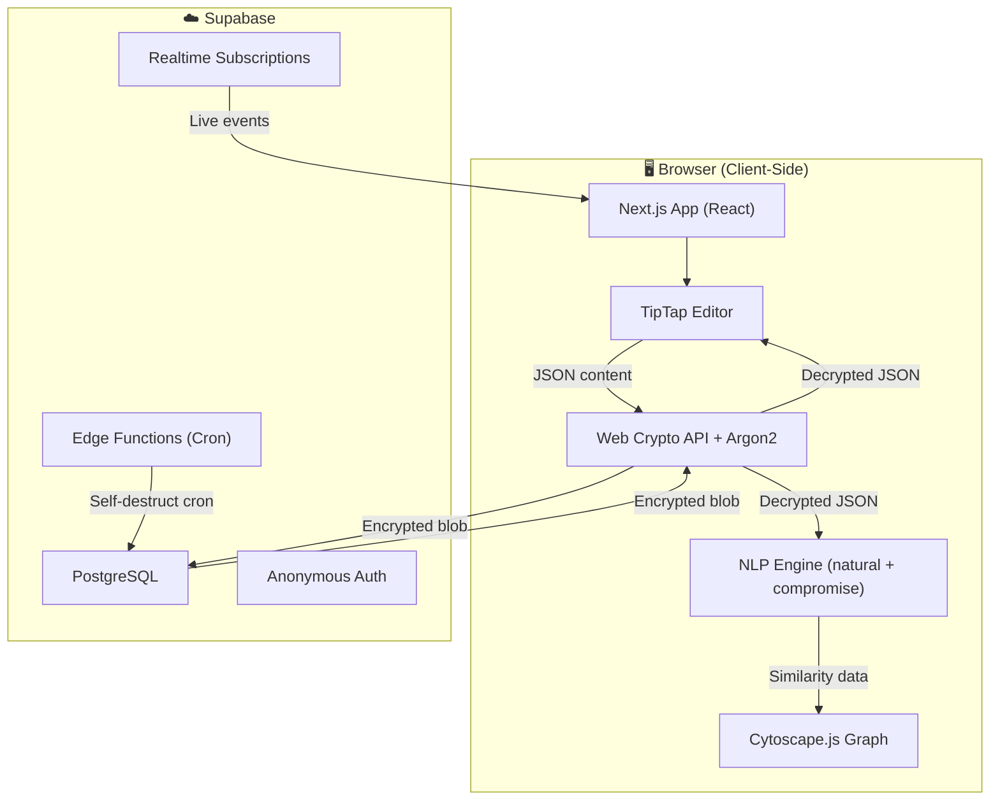
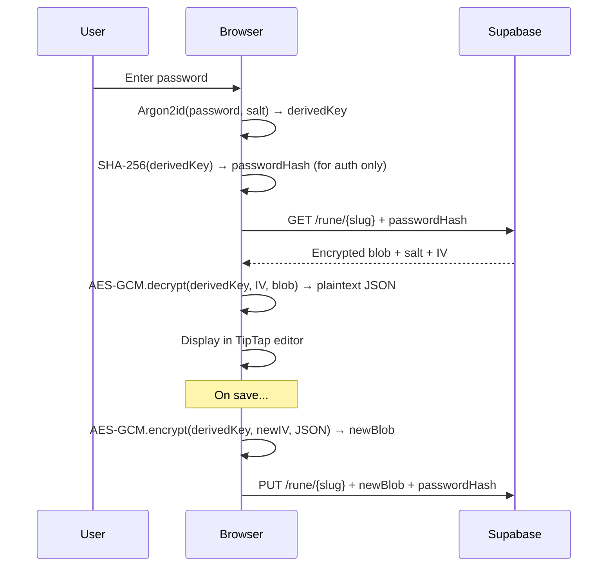

# Rune — Encrypted Premium Notepad

A premium, encrypted notepad web application inspired by ProtectedText.com with Notion-like editing, dual-password workspaces, scheduled self-destruction, homepage analytics, and an Obsidian-like knowledge graph.

## Tech Stack

| Layer | Technology | Rationale |
|---|---|---|
| **Framework** | Next.js 15 (App Router) | Full-stack React with API routes, SSR for homepage |
| **Backend/DB** | Supabase (Postgres + Edge Functions) | Managed PostgreSQL, realtime subscriptions, edge functions for scheduled tasks, free tier for dev |
| **Rich Text Editor** | TipTap (ProseMirror-based) | Headless, extensible, Notion-like slash commands, bubble menus, block-based editing |
| **Encryption** | Web Crypto API (AES-GCM) + Argon2 (via `argon2-browser`) | Client-side encryption; server never sees plaintext; Argon2 for key derivation |
| **NLP** | `natural` (TF-IDF) + `compromise` (tokenization) | Client-side keyword extraction and similarity calculation after decryption |
| **Graph Visualization** | Cytoscape.js | Interactive force-directed graph for Obsidian-like knowledge view |
| **Styling** | Vanilla CSS with CSS custom properties | Full control, premium glassmorphism, gradients, micro-animations |
| **Font** | Inter (Google Fonts) | Modern, premium typography |
| **Deployment** | Vercel | Native Next.js hosting, edge functions, zero-config |

---

## Architecture Overview



### Encryption Flow (Client-Side Only)



### Dual-Password System

Each Rune URL has **two independent encrypted workspaces**:

- **Password A** → Workspace A (encrypted with Key A)
- **Password B** → Workspace B (encrypted with Key B)

The server stores two encrypted blobs per Rune slug, keyed by the hash of each password. When a user enters a password, the hash is compared to find the matching workspace. The user sets Password A on first visit, and can optionally add Password B from within their workspace settings.

> [!IMPORTANT]
> The server cannot tell which password unlocked which workspace — it only matches password hashes. This means plausible deniability is built in: you can give someone Password A (showing safe content) while Password B contains private content.

---

## Database Schema (Supabase PostgreSQL)

```sql
-- Rune sites (one per URL slug)
CREATE TABLE runes (
    id UUID PRIMARY KEY DEFAULT gen_random_uuid(),
    slug TEXT UNIQUE NOT NULL,          -- URL path e.g. "my-secret-notes"
    created_at TIMESTAMPTZ DEFAULT NOW(),
    self_destruct_at TIMESTAMPTZ,       -- NULL = no self-destruct
    self_destruct_warning_sent BOOLEAN DEFAULT FALSE,
    is_destroyed BOOLEAN DEFAULT FALSE
);

-- Workspaces (up to 2 per rune, one per password)
CREATE TABLE workspaces (
    id UUID PRIMARY KEY DEFAULT gen_random_uuid(),
    rune_id UUID REFERENCES runes(id) ON DELETE CASCADE,
    password_hash TEXT NOT NULL,         -- SHA-256 of Argon2-derived key
    password_salt TEXT NOT NULL,         -- Salt for Argon2
    created_at TIMESTAMPTZ DEFAULT NOW(),
    last_accessed_at TIMESTAMPTZ DEFAULT NOW(),
    UNIQUE(rune_id, password_hash)
);

-- Tabs within a workspace (like ProtectedText tabs)
CREATE TABLE tabs (
    id UUID PRIMARY KEY DEFAULT gen_random_uuid(),
    workspace_id UUID REFERENCES workspaces(id) ON DELETE CASCADE,
    encrypted_content TEXT,             -- AES-GCM encrypted TipTap JSON
    encrypted_title TEXT,               -- AES-GCM encrypted tab title
    iv TEXT NOT NULL,                    -- Initialization vector for AES
    sort_order INTEGER DEFAULT 0,
    content_hash TEXT,                  -- For overwrite protection
    created_at TIMESTAMPTZ DEFAULT NOW(),
    updated_at TIMESTAMPTZ DEFAULT NOW()
);

-- Anonymous analytics (no personal data)
CREATE TABLE analytics_events (
    id BIGSERIAL PRIMARY KEY,
    event_type TEXT NOT NULL,           -- 'rune_created', 'rune_accessed', 'rune_destroyed', 'tab_created'
    created_at TIMESTAMPTZ DEFAULT NOW(),
    metadata JSONB DEFAULT '{}'         -- Non-identifying metadata (e.g., tab_count)
);

-- Aggregate stats (updated periodically)
CREATE TABLE analytics_stats (
    id SERIAL PRIMARY KEY,
    stat_key TEXT UNIQUE NOT NULL,       -- 'total_runes', 'active_today', 'total_tabs', etc.
    stat_value BIGINT DEFAULT 0,
    updated_at TIMESTAMPTZ DEFAULT NOW()
);
```

---

## Proposed Changes

### Phase 1: Project Setup & Foundation

#### [NEW] Project initialization
- Initialize Next.js 15 project with App Router in `d:\Probably Useful\rune\`
- Install dependencies: `@tiptap/react`, `@tiptap/starter-kit`, `@tiptap/extension-*`, `@supabase/supabase-js`, `argon2-browser`, `natural`, `compromise`, `cytoscape`
- Configure Supabase client

#### [NEW] [globals.css](file:///d:/Probably Useful/rune/src/app/globals.css)
- Complete design system with CSS custom properties
- Dark theme (deep navy/charcoal base with purple/cyan accent gradients)
- Glassmorphism utilities (backdrop-blur, frosted glass panels)
- Premium typography (Inter font family)
- Micro-animation keyframes (fade-in, slide-up, pulse, glow)
- Responsive breakpoints

#### [NEW] [layout.tsx](file:///d:/Probably Useful/rune/src/app/layout.tsx)
- Root layout with Inter font, meta tags, SEO
- Global providers (Supabase client context)

---

### Phase 2: Homepage & Analytics

#### [NEW] [page.tsx](file:///d:/Probably Useful/rune/src/app/page.tsx)
- Premium landing page with animated hero section
- "Go to your Rune" input (like ProtectedText but premium)
- Feature highlights with glassmorphism cards
- FAQ section with smooth accordion animations

#### [NEW] [AnalyticsDashboard.tsx](file:///d:/Probably Useful/rune/src/components/home/AnalyticsDashboard.tsx)
- Real-time global stats cards (total Runes, active today, total notes, uptime)
- Animated counters with spring animations
- Live activity feed using Supabase Realtime subscriptions
- Anonymized events: "A new Rune was forged 🔥", "A Rune was accessed 🔓", "A Rune self-destructed 💀"
- Pulsing dot indicators for live data

#### [NEW] [LiveFeed.tsx](file:///d:/Probably Useful/rune/src/components/home/LiveFeed.tsx)
- Scrolling feed of anonymized platform activity
- Real-time updates via Supabase Realtime
- Smooth entry/exit animations for new events

#### [NEW] [StatsCard.tsx](file:///d:/Probably Useful/rune/src/components/home/StatsCard.tsx)
- Glassmorphism stat card with animated counter
- Gradient border glow effects
- Hover micro-interactions

---

### Phase 3: Encryption Layer

#### [NEW] [crypto.ts](file:///d:/Probably Useful/rune/src/lib/crypto.ts)
- `deriveKey(password, salt)` — Argon2id key derivation
- `encrypt(plaintext, key)` — AES-256-GCM encryption
- `decrypt(ciphertext, key, iv)` — AES-256-GCM decryption
- `hashPassword(derivedKey)` — SHA-256 hash for server-side auth matching
- `generateSalt()` — Crypto-random salt generation
- All operations use Web Crypto API (browser-native, no server calls)

#### [NEW] [supabase.ts](file:///d:/Probably Useful/rune/src/lib/supabase.ts)
- Supabase client initialization
- API helper functions for CRUD on runes, workspaces, tabs
- Realtime subscription helpers

---

### Phase 4: Rune Workspace (Core Feature)

#### [NEW] [[slug]/page.tsx](file:///d:/Probably Useful/rune/src/app/[slug]/page.tsx)
- Dynamic route for each Rune URL (e.g., `/my-secret-notes`)
- Password dialog (premium modal with glassmorphism)
- First-visit flow: set Password A, optionally set Password B
- Loads encrypted workspace after password verification
- Self-destruct banner if scheduled

#### [NEW] [PasswordModal.tsx](file:///d:/Probably Useful/rune/src/components/workspace/PasswordModal.tsx)
- Premium unlock dialog with animated lock icon
- Password input with strength indicator
- "Set up dual password" toggle for first-time setup
- Error animation on wrong password
- Keyboard shortcut support (Enter to submit)

#### [NEW] [WorkspaceLayout.tsx](file:///d:/Probably Useful/rune/src/components/workspace/WorkspaceLayout.tsx)
- Main workspace container with sidebar + editor area
- Tab bar (like ProtectedText) with add/remove/reorder
- Default "Dashboard" tab (analytics + knowledge graph)
- Settings panel (self-destruct scheduling, add second password)
- Auto-save indicator with encryption status

#### [NEW] [TabBar.tsx](file:///d:/Probably Useful/rune/src/components/workspace/TabBar.tsx)
- Horizontal tab strip with drag-to-reorder
- Tab titles derived from first line of content (like ProtectedText)
- Add new tab button with smooth animation
- Close tab with confirmation
- Active tab highlight with gradient underline

---

### Phase 5: Notion-Like Editor (TipTap)

#### [NEW] [RuneEditor.tsx](file:///d:/Probably Useful/rune/src/components/editor/RuneEditor.tsx)
- TipTap editor instance with premium styling
- Extensions: StarterKit, Placeholder, SlashCommand, BubbleMenu, FloatingMenu, TaskList, CodeBlock (with syntax highlighting), Image, Table, Highlight, Typography
- Block-based editing with drag handles
- Slash command menu (`/` to insert blocks: heading, list, code, table, image, divider, callout)
- Bubble menu on text selection (bold, italic, underline, strike, link, highlight, code)
- Notion-like placeholder text ("Type '/' for commands...")
- Auto-save on content change (debounced, encrypts then sends to Supabase)
- Content stored as TipTap JSON (not HTML) for NLP processing

#### [NEW] [SlashCommandMenu.tsx](file:///d:/Probably Useful/rune/src/components/editor/SlashCommandMenu.tsx)
- Floating menu triggered by `/` keystroke
- Categorized block types with icons
- Keyboard navigation (arrow keys + Enter)
- Fuzzy search filtering
- Smooth appear/disappear animation

#### [NEW] [BubbleToolbar.tsx](file:///d:/Probably Useful/rune/src/components/editor/BubbleToolbar.tsx)
- Floating toolbar on text selection
- Formatting options with toggle states
- Link insertion with URL input
- Color/highlight picker
- Glassmorphism styling

#### [NEW] [editor.css](file:///d:/Probably Useful/rune/src/components/editor/editor.css)
- Premium editor styling matching Notion aesthetics
- Block-level spacing and typography
- Code block syntax highlighting theme
- Task list custom checkboxes
- Table styling with alternating rows
- Placeholder styling

---

### Phase 6: Self-Destruction System

#### [NEW] [SelfDestructSettings.tsx](file:///d:/Probably Useful/rune/src/components/workspace/SelfDestructSettings.tsx)
- Date/time picker for scheduling destruction
- Preset options: 1 hour, 24 hours, 7 days, 30 days, custom
- Visual countdown timer showing time remaining
- Warning badge when < 24 hours remaining
- Cancel self-destruct option
- Confirmation dialog with "type DESTROY to confirm"

#### [NEW] Supabase Edge Function: `self-destruct-cron`
- Runs every minute via Supabase pg_cron
- Checks for runes where `self_destruct_at <= NOW()`
- Sends 24-hour warning (sets `self_destruct_warning_sent = true`)
- Permanently deletes rune data (all workspaces + tabs) when time expires
- Logs `rune_destroyed` analytics event
- Clears the slug so it cannot be reclaimed

---

### Phase 7: Knowledge Graph & NLP Dashboard

#### [NEW] [RuneDashboard.tsx](file:///d:/Probably Useful/rune/src/components/dashboard/RuneDashboard.tsx)
- Default first tab in every workspace
- Personal analytics: total tabs, total words, most active tab, content age
- Knowledge graph (Cytoscape.js) showing connections between tabs
- Content similarity heatmap

#### [NEW] [KnowledgeGraph.tsx](file:///d:/Probably Useful/rune/src/components/dashboard/KnowledgeGraph.tsx)
- Cytoscape.js force-directed graph
- Each tab = one node (labeled with tab title)
- Edges = similarity score between tabs (cosine similarity of TF-IDF vectors)
- Edge thickness proportional to similarity strength
- Similarity threshold slider (hide weak connections)
- Node click = navigate to that tab
- Cluster coloring based on topic groups
- Animated graph physics (nodes repel, similar nodes attract)
- Premium styling: glowing nodes, gradient edges, dark background

#### [NEW] [nlp.ts](file:///d:/Probably Useful/rune/src/lib/nlp.ts)
- `extractText(tiptapJSON)` — Recursively extract plain text from TipTap JSON
- `tokenize(text)` — Tokenize and remove stop words using `compromise`
- `calculateTFIDF(documents[])` — TF-IDF vectors for all tabs using `natural`
- `cosineSimilarity(vecA, vecB)` — Cosine similarity between two vectors
- `buildSimilarityMatrix(documents[])` — Full pairwise similarity matrix
- `extractKeywords(text, topN)` — Top N keywords per document
- `clusterDocuments(similarityMatrix)` — Simple agglomerative clustering for node coloring

---

### Phase 8: API Routes

#### [NEW] [route.ts](file:///d:/Probably Useful/rune/src/app/api/rune/[slug]/route.ts)
- `GET` — Fetch encrypted workspace by slug + password hash
- `PUT` — Save encrypted workspace (with overwrite protection via content hash)
- `POST` — Create new rune + first workspace
- `DELETE` — Delete rune (requires password hash)

#### [NEW] [route.ts](file:///d:/Probably Useful/rune/src/app/api/rune/[slug]/self-destruct/route.ts)
- `POST` — Schedule self-destruction (set timestamp)
- `DELETE` — Cancel self-destruction

#### [NEW] [route.ts](file:///d:/Probably Useful/rune/src/app/api/analytics/route.ts)
- `GET` — Fetch aggregate analytics stats
- Supabase Realtime channel for live events

---

## File Structure

```
d:\Probably Useful\rune\
├── src/
│   ├── app/
│   │   ├── globals.css                 # Design system
│   │   ├── layout.tsx                  # Root layout
│   │   ├── page.tsx                    # Homepage
│   │   ├── [slug]/
│   │   │   └── page.tsx               # Rune workspace page
│   │   └── api/
│   │       ├── rune/
│   │       │   └── [slug]/
│   │       │       ├── route.ts       # CRUD for rune data
│   │       │       └── self-destruct/
│   │       │           └── route.ts   # Self-destruct scheduling
│   │       └── analytics/
│   │           └── route.ts           # Analytics API
│   ├── components/
│   │   ├── home/
│   │   │   ├── AnalyticsDashboard.tsx
│   │   │   ├── LiveFeed.tsx
│   │   │   └── StatsCard.tsx
│   │   ├── workspace/
│   │   │   ├── PasswordModal.tsx
│   │   │   ├── WorkspaceLayout.tsx
│   │   │   ├── TabBar.tsx
│   │   │   └── SelfDestructSettings.tsx
│   │   ├── editor/
│   │   │   ├── RuneEditor.tsx
│   │   │   ├── SlashCommandMenu.tsx
│   │   │   ├── BubbleToolbar.tsx
│   │   │   └── editor.css
│   │   └── dashboard/
│   │       ├── RuneDashboard.tsx
│   │       └── KnowledgeGraph.tsx
│   └── lib/
│       ├── crypto.ts                   # Client-side encryption
│       ├── supabase.ts                 # Supabase client + helpers
│       └── nlp.ts                      # NLP pipeline
├── supabase/
│   ├── migrations/
│   │   └── 001_initial_schema.sql     # Database schema
│   └── functions/
│       └── self-destruct-cron/
│           └── index.ts               # Edge function for scheduled deletion
├── public/
│   └── fonts/                         # Inter font files (optional, can use Google Fonts CDN)
├── next.config.js
├── package.json
└── tsconfig.json
```

---

## Design Direction

### Color Palette
| Token | Value | Usage |
|---|---|---|
| `--bg-primary` | `#0a0a0f` | Deep space black background |
| `--bg-secondary` | `#12121a` | Card/panel backgrounds |
| `--bg-elevated` | `#1a1a2e` | Elevated surfaces, modals |
| `--accent-primary` | `#7c3aed` | Primary purple (buttons, links) |
| `--accent-secondary` | `#06b6d4` | Cyan accent (highlights, graphs) |
| `--accent-gradient` | `linear-gradient(135deg, #7c3aed, #06b6d4)` | Premium gradient |
| `--text-primary` | `#f0f0f5` | Main text |
| `--text-secondary` | `#8888aa` | Muted text |
| `--glass-bg` | `rgba(255,255,255,0.05)` | Glassmorphism panels |
| `--glass-border` | `rgba(255,255,255,0.1)` | Glass borders |
| `--danger` | `#ef4444` | Self-destruct, delete |
| `--success` | `#10b981` | Save confirmed, online |

### Visual Features
- **Glassmorphism** on all panels, modals, and cards (backdrop-filter: blur)
- **Gradient borders** using pseudo-elements with conic gradients
- **Micro-animations**: fade-in on mount, slide-up for modals, pulse for live indicators, glow for active elements
- **Smooth transitions**: 200ms ease-out on all interactive elements
- **Particle or mesh gradient background** on homepage hero
- **Dark mode only** — premium, modern aesthetic

---

## User Review Required

> [!IMPORTANT]
> **Supabase Setup Required**: You will need to create a Supabase project and provide the project URL and anon key. I can set up the project with placeholder values that you can replace. Would you like me to:
> - (A) Use placeholder Supabase credentials and you'll replace them later?
> - (B) Wait for you to create a Supabase project first?

> [!WARNING]
> **No real encryption without proper Argon2 WASM**: The `argon2-browser` package uses WebAssembly for Argon2id key derivation. This works in modern browsers but adds ~200KB to the bundle. If bundle size is a concern, we could fall back to PBKDF2 (native Web Crypto API, smaller but less secure against GPU attacks).

---

## Open Questions

> [!IMPORTANT]
> 1. **Domain**: Will this be deployed at a custom domain (e.g., `rune.app`) or is `localhost` development sufficient for now?
> 2. **Supabase credentials**: Do you have a Supabase project ready, or should I use placeholders?
> 3. **Self-destruct notification**: When 24h warning fires, should there be any notification mechanism (email? none — just a banner when the user visits)?
> 4. **Graph NLP scope**: The NLP runs client-side after decryption. For a Rune with 20+ tabs, the TF-IDF computation may take 1-2 seconds. Is that acceptable, or should we add a loading indicator + web worker for background processing?

---

## Verification Plan

### Automated Tests
- Editor rendering and slash command menu interaction
- Encryption round-trip: encrypt → decrypt → verify content matches
- API route testing: create rune, save tab, fetch tab, delete rune
- NLP pipeline: TF-IDF extraction, cosine similarity calculation

### Manual Verification
- Run locally with `npm run dev`
- Test full flow: visit homepage → create Rune → set passwords → write content → switch tabs → view knowledge graph
- Test dual-password: log in with Password A, log out, log in with Password B, verify separate workspaces
- Test self-destruct scheduling and countdown display
- Test homepage analytics live feed
- Visual polish check on all screens
